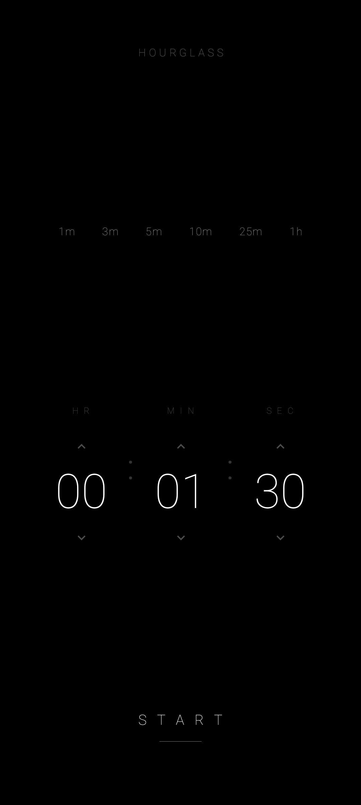

# Flux Hourglass

> An ultra-minimalist particle-physics hourglass timer for Android.
> Pure black-and-white, no network, no analytics, no ads.

<p align="center">
  
</p>

<p align="center">
  <a href="https://github.com/jeiel85/flux-hourglass-android/actions/workflows/android-ci.yml">
    
  </a>
  <a href="https://github.com/jeiel85/flux-hourglass-android/releases">
    
  </a>
  
  
</p>

## Highlights

- **Particle-physics hourglass.** Each grain is an independent particle that falls, collides, and is absorbed into a sand pile that grows toward 50% of the screen as the timer ends.
- **Tilt-aware.** The accelerometer feeds a live gravity vector into the slumping pass — tip the phone and the pile pours toward the lower edge.
- **Touch-to-reveal time.** Press anywhere on the running screen to fade in exact remaining `HH : MM : SS`; release to return to pure sand.
- **Quick presets.** `1m / 3m / 5m / 10m / 25m / 1h` chips seed the pickers in one tap.
- **Pause / Resume.** Faint controls opposite reset; pause shows exact remaining time + percent.
- **Remembers last duration.** A DataStore persists the last duration so pickers are pre-seeded.
- **Sandbox Settings Panel.** Real-time sliders to customize Gravity Sensitivity ($0.3\times$ to $2.5\times$), Particle Size ($0.6\times$ to $2.2\times$), and Particle Density ($0.5\times$ to $2.0\times$) in real-time.
- **Procedural Soundscapes.** Math-modeled real-time PCM audio synthesis for sand grains, campfire, and waves, utilizing zero-byte resource files.
- **Interactive Obstacle Drawing.** Drag-to-draw temporary fading barrier lines that deflect sand particles and water splashes dynamically using elastic 2D collision physics.
- **Four focused visualizer modes.** Includes Sand (particle-physics hourglass), LED (liquid-level dot matrix that tilts like a real surface), Water (sloshing waves, bubbles, splashes), and Fire (campfire that burns down to glowing embers).

## Version history

| Version | Date | Notes |
|---------|------|-------|
| [1.9.1](docs/releases/v1.9.1.md) | 2026-06-15 | Fix: time picker & START button could disappear on the setup screen |
| [1.9.0](docs/releases/v1.9.0.md) | 2026-06-15 | Swipeable single-row object selector |
| [1.8.0](docs/releases/v1.8.0.md) | 2026-06-15 | Sandbox Settings, Procedural Soundscapes, Interactive obstacle drawing |
| [1.7.0](docs/releases/v1.7.0.md) | 2026-06-14 | 5 premium modes: Magnetic, Aurora, Rain, Black Hole, Electric |
| [1.6.0](docs/releases/v1.6.0.md) | 2026-06-13 | Premium Fire Mode + interactive tilt physics |
| [1.5.0](docs/releases/v1.5.0.md) | 2026-05-28 | Premium Water Mode + spring-damper sloshing, Immersive Mode |
| [1.4.0](docs/releases/v1.4.0.md) | 2026-05-28 | SNAPPING gravity screen rotation & pile rescaling |
| [1.3.0](docs/releases/v1.3.0.md) | 2026-05-28 | Retro LED Grid Mode & gyro-based pile slumping |
| [1.2.0](docs/releases/v1.2.0.md) | 2026-05-27 | Completion chime + persisted last duration |
| [1.1.0](docs/releases/v1.1.0.md) | 2026-05-27 | Quick presets, pause/resume, keep-screen-on |
| [1.0.0](docs/releases/v1.0.0.md) | 2026-05-27 | Initial release — particle hourglass core |

See [`CHANGELOG.md`](CHANGELOG.md) for the full log.

## Build

Requirements:

- Android Studio Hedgehog+ (Android Gradle Plugin 9.1)
- JDK 21
- Android SDK 36

```powershell
# Debug APK -> app/build/outputs/apk/debug/
.\gradlew.bat assembleDebug

# Unit + Roborazzi screenshot tests
.\gradlew.bat test
```

The repo ships `debug.keystore.base64`. Decode it once with
`certutil -decode debug.keystore.base64 debug.keystore` so debug builds are
signed with a stable SHA.

## Release

A signed release needs four environment variables — `KEYSTORE_PATH`,
`STORE_PASSWORD`, `KEY_ALIAS`, `KEY_PASSWORD` (CI also accepts the `RELEASE_*`
variants). The end-to-end procedure is documented in [`RELEASE.md`](RELEASE.md).

```powershell
$env:KEYSTORE_PATH = "$HOME\.keystore\flux-hourglass-upload.jks"
$env:STORE_PASSWORD = "***"
$env:KEY_ALIAS = "upload"
$env:KEY_PASSWORD = "***"

.\scripts\build_release.ps1 -Version 1.2.0 -VersionCode 3
```

This runs tests, produces signed APK + AAB, and copies
`flux-hourglass-v{ver}-vc{code}.{apk,aab}` to the desktop ready for Play
Console upload.

## CI

- [`.github/workflows/android-ci.yml`](.github/workflows/android-ci.yml) — unit tests + `assembleDebug` on every push/PR.
- [`.github/workflows/release.yml`](.github/workflows/release.yml) — signed APK + AAB build, GitHub Release published from `docs/releases/vX.Y.Z.md` when a `vX.Y.Z` tag is pushed.

Both expect the release keystore base64-encoded in the
`RELEASE_KEYSTORE_BASE64` secret plus the three password secrets.

## Permissions

`VIBRATE` only. No `INTERNET`. No location. No camera. No storage.

## License

This repository is the personal codebase of [@jeiel85](https://github.com/jeiel85).
All rights reserved unless an explicit license is added.

---

<a id="kr"></a>

## 한국어 안내

칠흑 같은 배경에 입자 물리 기반의 모래시계 한 개만 있는 Android 타이머입니다.
네트워크·광고·분석 코드 없음, 권한은 `VIBRATE` 하나뿐.

### 주요 기능

- **입자 물리 모래시계** — 각 모래알이 독립 입자로 떨어지고 충돌하며 화면 절반 높이까지 쌓입니다.
- **기기 기울임 인식** — 가속도계가 중력 벡터를 실시간으로 넘겨 기울이면 모래가 낮은 쪽으로 쏠립니다.
- **꾹 누르면 시간 표시** — 화면을 누르고 있는 동안 정확한 `HH : MM : SS`가 나타납니다.
- **빠른 프리셋** — `1m / 3m / 5m / 10m / 25m / 1h` 한 번 탭으로 시·분·초가 채워집니다.
- **일시정지/재개** — `P A U S E` 후 남은 시간과 잔여 비율을 표시, `R E S U M E`으로 그 시점부터 다시 카운트다운.
- **타이머 동안 화면 켜짐** — 실행 상태에서만 `FLAG_KEEP_SCREEN_ON`을 걸고, 일시정지·완료·리셋 즉시 해제.
- **마지막 시간 기억** — 종료 후 다시 켜도 직전에 시작했던 시·분·초가 그대로 채워져 있습니다.
- **부드러운 완료음** — 알림 스트림에 세 음짜리 톤을 짧게 울려 진동과 함께 종료를 알립니다. 무음/방해금지 설정을 그대로 따릅니다.
- **샌드박스 설정 패널**: 중력 감도(0.3x ~ 2.5x), 입자 크기(0.6x ~ 2.2x), 입자 밀도(0.5x ~ 2.0x)를 자유롭게 실시간 조절 (Setup 화면의 S E T T 버튼).
- **실시간 알고리즘 사운드**: 알고리즘에 기반해 모래알 떨어지는 소리, 모닥불 장작 소리, 파도 소리를 리소스 없이 실시간 PCM 합성 (SOUND 토글).
- **인터랙티브 장애물 그리기**: 화면을 문질러 임시 장애물 선을 그리면 모래알과 물보라가 탄성 물리로 튕겨 나감 (드래그 드로잉).
- **4가지 비주얼라이저 모드**: 입자 물리 모래시계(Sand), 액체 수면처럼 기울어지는 도트 매트릭스(LED), 슬로싱 파도·버블·스플래시(Water), 타다가 잔불로 꺼지는 모닥불(Fire)을 탑재.

### 빌드·릴리즈 절차

이 저장소에서 새 버전을 만드는 정해진 절차는 [`RELEASE.md`](RELEASE.md)에
한국어로 정리되어 있습니다.

### 랜딩 페이지

[flux-hourglass-android 랜딩 페이지](https://jeiel85.github.io/flux-hourglass-android/) —
GitHub Pages로 `docs/` 폴더를 그대로 호스팅합니다.
